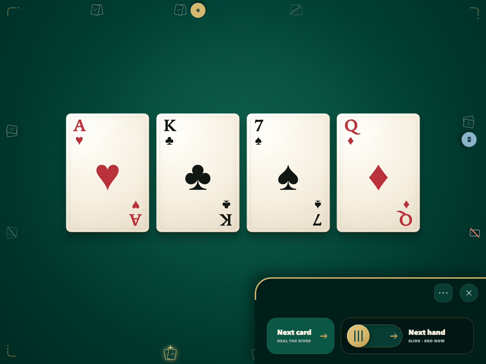
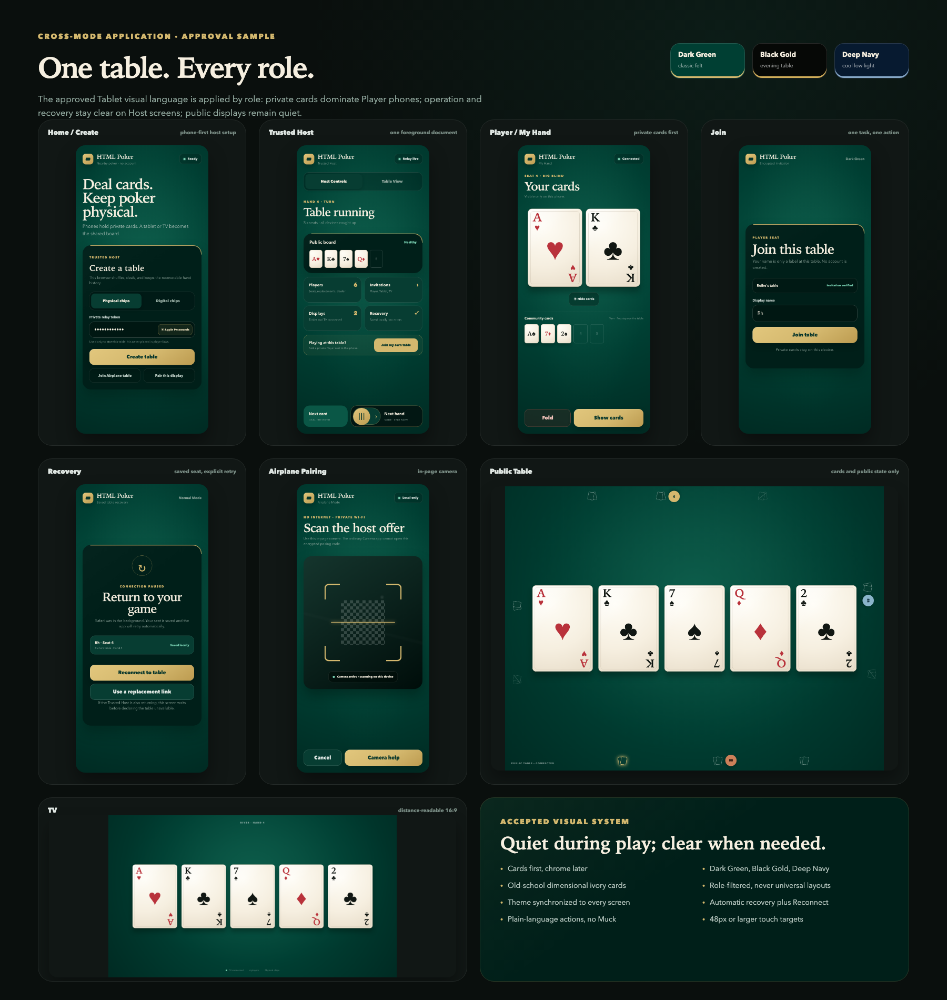
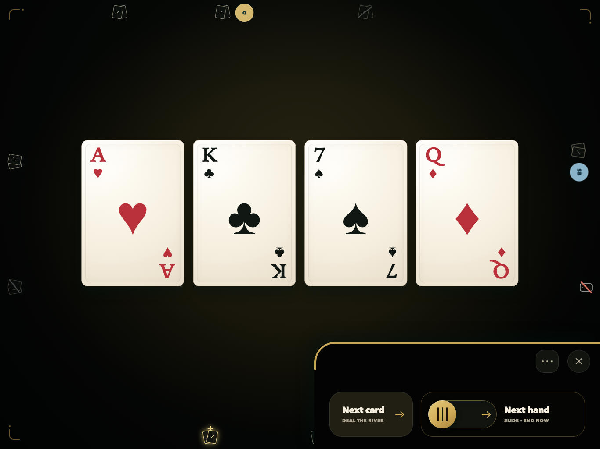
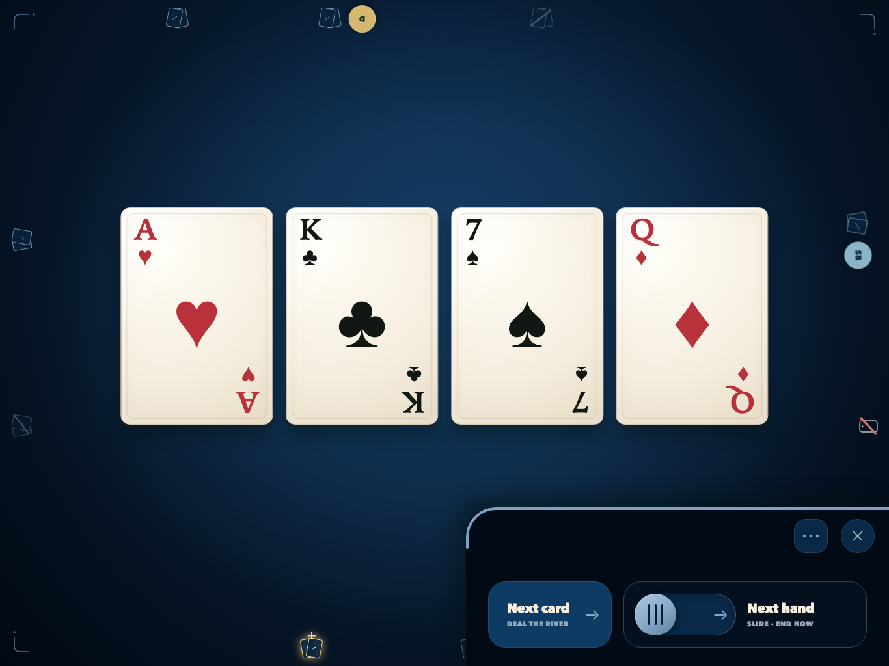

<p align="center">
  <picture>
    <source media="(prefers-color-scheme: dark)" srcset="assets/brand/svg/horizontal-green-transparent.svg">
    
  </picture>
</p>

<p align="center">
  <strong>Deal cards. Keep poker yours.</strong><br>
  A quiet, privacy-first browser dealer for the table already in front of you.
</p>

<p align="center">
  <a href="https://cai-ruihe.github.io/our-poker-table/">Open the same-Wi-Fi field build</a>
  &nbsp;·&nbsp;
  <a href="https://cai-ruihe.github.io/our-poker-table/normal/">Open Normal Mode</a>
  &nbsp;·&nbsp;
  <a href="#quick-start">Run it yourself</a>
</p>

<p align="center"><sub>PLAY CHIPS ONLY &nbsp;·&nbsp; NO ACCOUNTS &nbsp;·&nbsp; NO ANALYTICS &nbsp;·&nbsp; OPEN SOURCE</sub></p>

<p align="center">
  
</p>

<p align="center"><sub>DARK GREEN · PUBLIC TABLE · REAL PHASE 1 RENDER</sub></p>

## The deck work disappears. The table stays.

Our Poker Table is an open-source browser companion for in-person, play-chip
Texas Hold'em. One Trusted Host browser owns the shuffle and deal. Each player
phone receives only its own hole cards and legal actions; a tablet or TV
receives only public table information. Physical chips and conversation stay
where they belong: around the table.

| Private by projection | Made for the room | Open and portable |
| --- | --- | --- |
| Hidden cards are filtered before they leave the Trusted Host—not merely concealed in the interface. | Phones hold private hands while a shared screen becomes the board. Every role gets a purpose-built view. | Run the static Normal build with your own connection service, or preload the standalone Airplane build for local Wi-Fi. |

It is not an online gambling product. It has no money, cash-out, rake, player
accounts, or required central poker engine. An optional Digital Chips profile
is under active development and remains explicitly experimental.

## One table. Every role.

The interface changes with the job in front of it. Private cards dominate a
player phone. The Trusted Host gets explicit hand and recovery controls. A
tablet or TV stays quiet and readable across the room. Joining and reconnecting
remain focused, single-purpose moments.

<p align="center">
  
</p>

<p align="center"><sub>CROSS-MODE APPLICATION BOARD · APPROVED PHASE 1 VISUAL SYSTEM</sub></p>

## The same hand, after dark.

Dark Green is the signature room. Black Gold and Deep Navy preserve the same
cards, geometry, controls, and state hierarchy for a warmer or cooler table.

<table>
  <tr>
    <td width="50%">
      
    </td>
    <td width="50%">
      
    </td>
  </tr>
  <tr>
    <td align="center"><sub>BLACK GOLD · EVENING TABLE</sub></td>
    <td align="center"><sub>DEEP NAVY · COOL LOW LIGHT</sub></td>
  </tr>
</table>

<p align="center"><sub>The Phase 1 product renders are preserved exactly as approved. Their working “HTML.Poker” UI label predates the final Our Poker Table identity.</sub></p>

## Project status

### Phase 2 — digital chips tracer

**Fact — first tracer implemented, explicitly experimental.** The repository can
create an optional two-player Digital Chips table and complete one hand: post
blinds, accept exact check/call/bet/raise/fold/all-in intents, advance the board
from committed betting rounds, recover the host mid-hand, propose a derived
settlement, and update stacks only after host confirmation. Late new seats and
a second hand fail closed. The selector is absent from the normal Phase 1 party
path and appears only with `?experimental=digital-chips`.

**Fact — deliberately incomplete.** Multiway short-all-in hardening, complex
side pots, top-ups/re-entry, dealer rotation, corrections, privacy-filtered
history export, property/differential testing, Airplane/device verification,
and release qualification remain open. It is development evidence, not a Phase
2 release or party-readiness claim.

See the [Phase 2 accounting architecture](docs/architecture/PHASE-2-ACCOUNTING.md) and [research foundation](docs/research/PHASE-2-ACCOUNTING-FOUNDATION.md).

### Phase 1 — trusted-host dealer

**Fact — implemented and automated locally.** The Phase 1 codebase supports two
to ten player seats, one-use/revocable QR or link invitations, role-scoped
Player/TV/Public Table/Tablet surfaces, private card projection, guarded hand
lifecycle, simple Show/Fold handling, three synchronized dark table themes,
four-sided Tablet controls, correction/void controls, encrypted IndexedDB
recovery, foreground reconnect with an explicit fallback action, redacted local
diagnostics, Normal Mode direct WebRTC with card-blind relay fallback, reverse
display pairing, and a standalone two-way-QR Airplane artifact with in-page
camera scanning and saved-image fallback.

**Fact — automated evidence.** Contract suites cover authority, identity, persistence, diagnostics, and relay isolation. Chromium and Mobile WebKit journeys cover a host joining its own table; switching among host/private/tablet views; live next-hand catch-up; sit-out, return, and permanent leave; complete Tablet secondary-action execution including a real seat-order mutation; exact approved slider/panel geometry; responsive overflow; and deterministic full-resolution visual baselines. Chromium additionally covers Normal direct/relay routes, reverse display pairing, stale-link diagnosis and ticket refresh after a service restart, plus standalone Airplane boot and pairing.

**Unknown — not a public release claim.** This local release candidate has not passed the required physical iOS/iPadOS, Android, TV, WAN-removal, hostile-network, already-connected-client survival across a Connection Service restart, or representative mainland-China matrices. Public source, Private Vulnerability Reporting, and a CI-gated field build do not replace protected branch rules, release signing, or the remaining device/network evidence. Those are explicit release gates, not omissions hidden by a passing local suite.

See the [Phase 1 local release-candidate record](docs/releases/PHASE-1-LOCAL-RC.md) for the exact boundary between demonstrated evidence and remaining gates.

## Same-Wi-Fi party build

The owner-authorized field build is published from `main` only after the configured CI and browser journey gates pass. GitHub's hosted Linux runner cannot expose a local ICE interface, so the three real Airplane peer-to-peer journeys remain mandatory local tests and are explicit hosted-CI skips rather than claimed passes:

**https://cai-ruihe.github.io/our-poker-table/**

Open that exact HTTPS address on the host and every iPhone, confirm **Build
0.1.5-phase1**, and create a fresh table. This removes copied-file version drift
and gives the in-page QR scanner a normal secure web origin. Use **Enlarge QR**
before each phone scans the laptop's offer. The page still uses Airplane Mode's
local, serverless WebRTC path after it loads; GitHub Pages does not receive cards
or table messages.

For the short operating sequence and phone-replacement recovery, use the [Airplane Mode party runbook](docs/operations/AIRPLANE-MODE.md#same-wi-fi-party-setup).

## Normal Mode field deployment

The owner-authorized Normal field build is published at:

**https://cai-ruihe.github.io/our-poker-table/normal/**

Normal Mode uses ordinary one-use invitation links/QRs and a card-blind Connection Service. The current field service runs on the owner's laptop through an outbound TLS tunnel, so the laptop and its container runtime must remain awake. The operator token stays outside the repository and public site. This temporary service has no uptime guarantee; it is not the later permanent deployment claim.

If the host phone or iPad is also playing, choose **Join my own table on this
device** before dealing and use **Host Controls**, **My Hand**, and **Table
View** in the same page. iOS may pause the host while another app is foreground;
the host and clients attempt authenticated catch-up when Safari returns, with a
visible **Reconnect to table** fallback. This is foreground recovery—not
background execution. The ordinary player QR/link is for other devices.

See [Normal Mode operations](docs/operations/NORMAL-MODE.md) for the host flow and restart procedure. Fork operators can create an isolated server with the [Normal Mode self-hosting guide](docs/operations/NORMAL-MODE-SELF-HOSTING.md); the repository includes a hardened Compose recipe, private token generator, and live relay doctor.

## Product constraints

- **Play chips only.** No money, payment, cash-out, rake, or gambling accounts.
- **Trusted Host.** The active host can inspect and manipulate the deck by design; encryption does not make a malicious or compromised host honest.
- **Card privacy first.** Other players, public surfaces, diagnostics, and the Connection Service do not receive unrevealed cards.
- **No required central poker engine.** Normal Mode prefers direct WebRTC, then an operator-owned private relay, then an optional operator-owned cloud relay. Airplane Mode has no internet dependency.
- **No player accounts.** A table-scoped credential restores a seat in the same browser; copied recovery links cannot open the same private seat simultaneously.
- **Quiet instrument, not casino UI.** Regular play stays on the table; uncommon administration lives in an off-table drawer.

## Quick start

Requires Node.js 24 and pnpm 11, pinned in [ADR-0007](docs/adr/0007-typescript-browser-monorepo-toolchain.md).

```sh
pnpm install --frozen-lockfile
pnpm dev
```

Open the local address shown by Vite. With no relay URL configured, the app provides same-browser Normal development using the browser channel. Use a current, secure browser; the host preflight fails closed when its cryptography, persistence, projection, or exclusivity prerequisites are absent.

Build both distributable forms with:

```sh
pnpm build
```

- `dist/normal/` is the static Normal Mode build.
- `dist/airplane/poker-airplane.html` is the standalone Airplane file. Open the downloaded file itself, not a development server.

For actual multi-device Normal Mode and Airplane Mode instructions, see [Normal Mode operations](docs/operations/NORMAL-MODE.md) and [Airplane Mode operations](docs/operations/AIRPLANE-MODE.md).

## Verify a change

```sh
pnpm check
pnpm test:coverage
pnpm qa:browser
pnpm audit:prod
pnpm licenses:prod
```

Playwright browsers are installed separately:

```sh
pnpm exec playwright install chromium webkit
```

Check build determinism after a committed change with:

```sh
pnpm release:reproducibility
```

After a clean, committed worktree has built the artifacts, create and verify a local provenance manifest with:

```sh
pnpm release:manifest
pnpm release:verify
```

The manifest is generated under ignored `dist/release/`; it is a local receipt, not a release signature.

## Architecture and documentation

- [Master PRD](docs/prd/MASTER-PRD.md) and [Phase 1 PRD](docs/prd/phases/P1-TRUSTED-HOST-DEALER.md)
- [Phase 1 runtime architecture](docs/architecture/PHASE-1-RUNTIME.md)
- [Repository layout](docs/architecture/REPOSITORY-LAYOUT.md)
- [Our Poker Table brand guidelines](docs/design/brand/README.md) and [canonical brand assets](assets/brand/README.md)
- [Shared visual system](docs/design/SHARED-VISUAL-SYSTEM.md)
- [Quality gates](docs/quality/QUALITY-GATES.md)
- [Traceable product QA system](docs/quality/QA-SYSTEM.md) and [machine-readable registry](docs/quality/qa-registry.yaml)
- [Card Privacy automated red-team record](docs/security/PHASE-1-CARD-PRIVACY-RED-TEAM.md)
- [Release checklist](docs/releasing/RELEASE-CHECKLIST.md)
- [Contributing](CONTRIBUTING.md), [Security](SECURITY.md), and [Governance](GOVERNANCE.md)

The project is Apache-2.0 licensed. See [THIRD_PARTY_NOTICES.md](THIRD_PARTY_NOTICES.md) and the bundled `THIRD-PARTY-LICENSES.txt` for dependency/font notices.

Project-owned brand assets are distributed under the same license; Apache-2.0
does not itself grant trademark rights. See the
[brand rights and licensing note](docs/design/brand/RIGHTS-AND-LICENSING.md).

## Open-source boundary

The source is public under Apache-2.0 at **https://github.com/Cai-Ruihe/our-poker-table**. Private Vulnerability Reporting, dependency alerts, and automatic security fixes are enabled for that repository. The Pages party build is an explicitly labelled field build; protected branch rules, release signing, an official versioned release, and any Connection Service deployment remain separate owner-controlled gates.

Bold Poker is an interaction reference only. HTML Poker is not affiliated with or endorsed by Bold Poker, and its code, branding, artwork, and exact interface expression are not copied.
