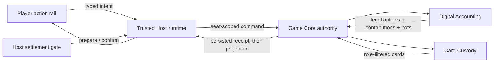

# Phase 2 digital-accounting architecture

**Status:** Active implementation reference for the first Phase 2 tracer slice. The Phase 2 and M10 PRDs remain normative.

## Current slice

The implemented vertical slice lets a host select Deal-Only or Digital Chips at
table creation only after deliberately opening the development URL with
`?experimental=digital-chips`. The default Phase 1 party URL exposes Deal-Only
only. A two-player Digital Chips table completes one tracer hand: it posts
blinds, exposes seat-private legal actions, advances streets only after
committed betting actions, derives a settlement proposal, and updates stacks
only after host confirmation. The Digital Chips join window closes when that
first deal begins; replacement credentials remain available, but late new seats
and a second hand fail closed until the session-policy slice is implemented.

## Authority and privacy boundaries

- Presentation clients never mutate stacks, pots, or streets. They emit a `BettingActionIntent`.
- Game Core authenticates the seat actor and binds the action to the current hand and revision.
- Digital Accounting owns betting legality, contributions, street closure, derived pots, awards, and chip conservation.
- Card Custody remains the only deck/private-card owner. Public accounting projections contain play-chip values but no hidden cards.
- The Trusted Host evaluates eligible hands and proposes settlement. Confirmation is a separate host-only command.
- Deal-Only tables do not instantiate accounting state and retain the Phase 1 manual street/end-hand flow.

## Persistence and compatibility

Accounting state is included in the same atomic authority state as custody, revision, and idempotency receipts. The selected rules profile is also encrypted in host recovery state so a lobby can recover before Game Core exists. The Phase 2 development build uses protocol version 2; mixed Phase 1/Phase 2 peers fail compatibility checks instead of guessing message meaning.

## Implemented evidence

- Accounting contract tests cover heads-up blinds, calls/checks, full raises, folds, called all-ins, settlement staging, ties, odd-chip ordering, and conservation.
- Game Core contract tests cover seat-private legal actions, betting-driven street reveals, host-only settlement preparation, and post-confirmation balance mutation.
- A Chromium journey creates a Digital Chips table and completes a heads-up hand across one host and two player pages.

## Deliberately incomplete

This tracer is not a Phase 2 release candidate or a party-ready mode. Multi-hand
sessions, late seats, multiway short-all-in reopening, complex side-pot vectors,
top-up/re-entry workflows, dealer rotation, correction/reopen policy,
privacy-filtered history export, remote Public Table qualification,
property/differential testing, and physical-device/Airplane verification remain
open.
